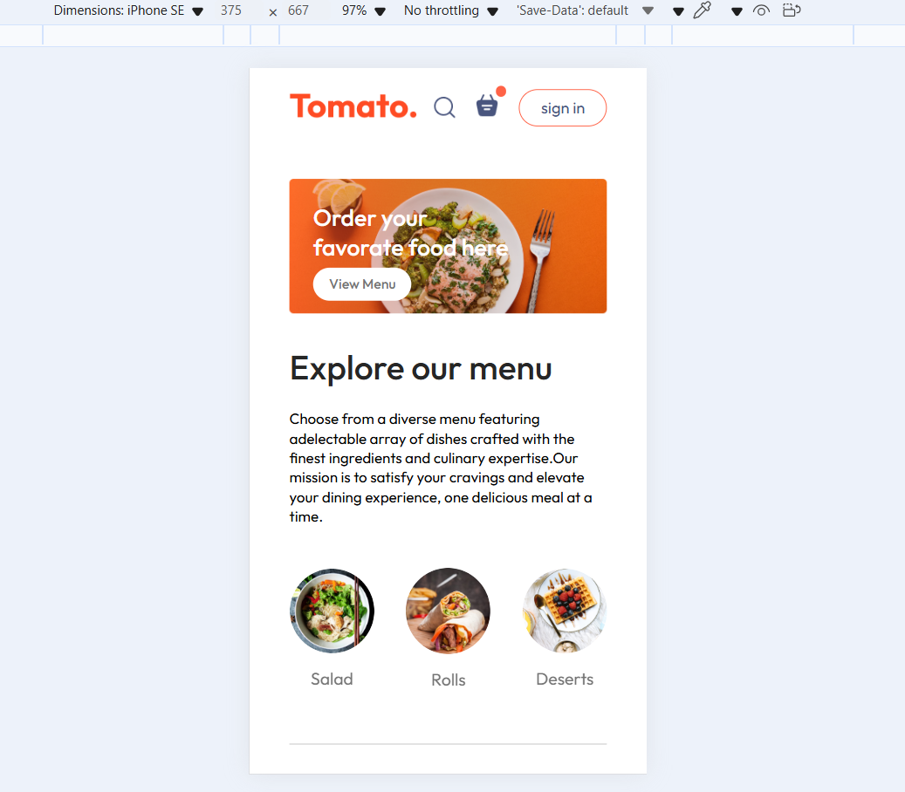
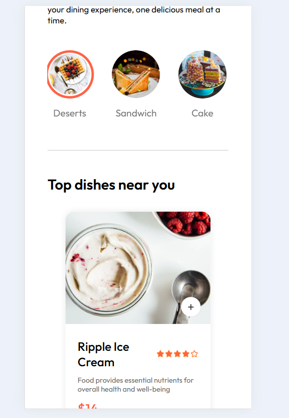
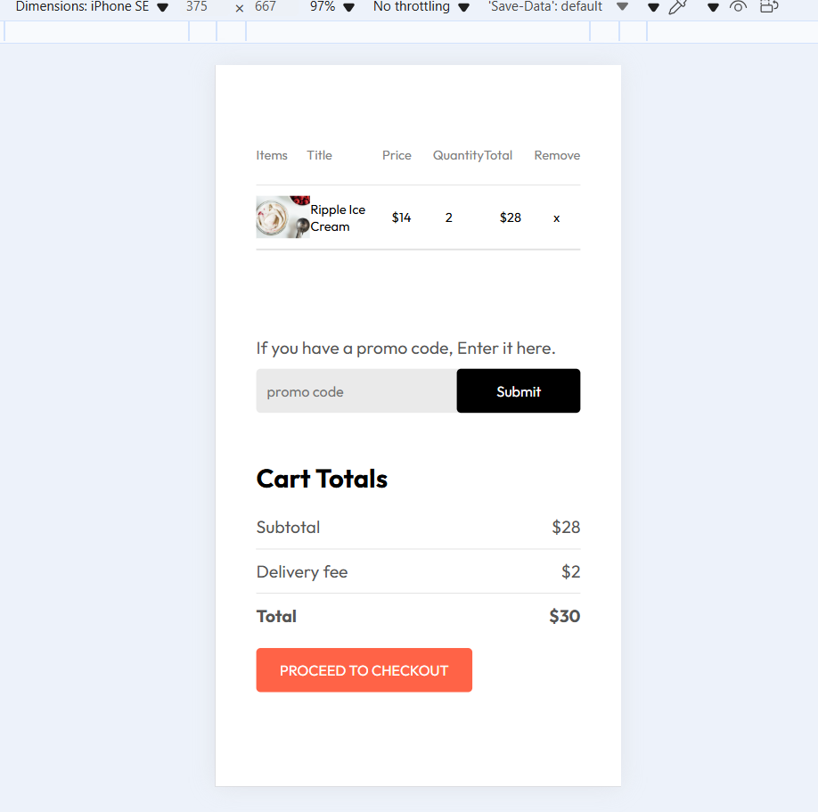
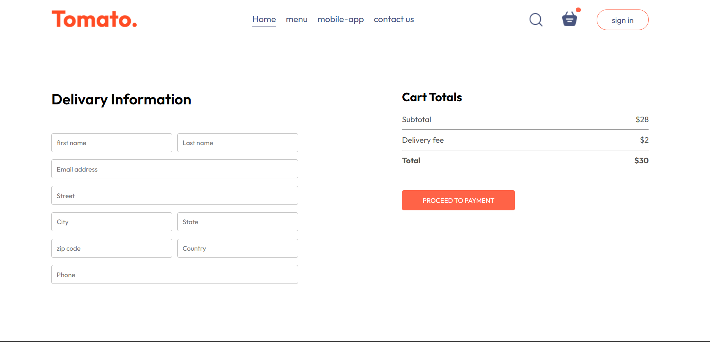
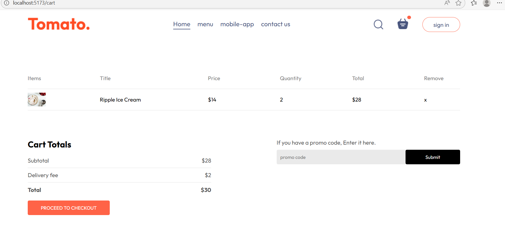
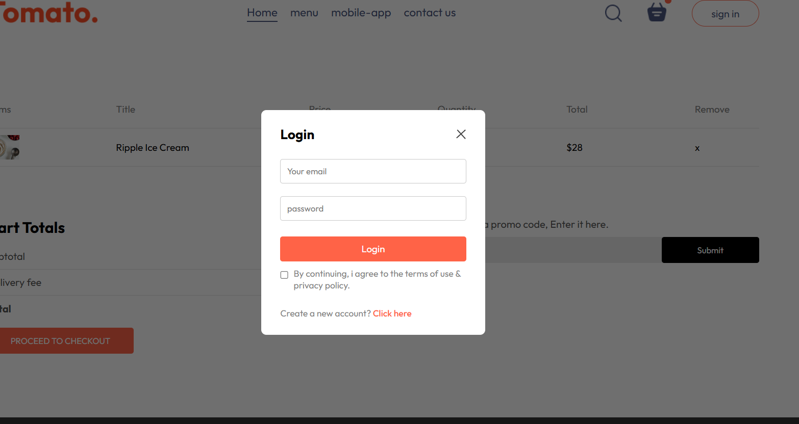

# food-del
# Food-Del 🍔

Food-Del is a **React-based food delivery application** that allows users to browse, select, and order food online. The app features a **responsive design**, a **registration/login system**, and **menu selection** for a smooth user experience.

---

## 🚀 Features

- Browse and search for food items
- **Select items from different menus**
- **User registration and login**
- Add items to the cart and place orders
- **Responsive design** for mobile and desktop
- Navigation with React Router

---

## 🛠️ Technologies

- **Frontend:** React.js, HTML, CSS
- **Routing:** React Router
---
Navigate into the project folder:
cd food-web

 

  
 
